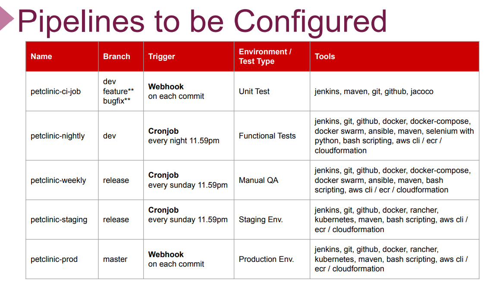

# Presentation Short Version

## Description
***
This project aims to create full CI/CD Pipeline for microservice based applications using [Spring Petclinic Microservices Application](https://github.com/spring-petclinic/spring-petclinic-microservices). Jenkins Server deployed on Elastic Compute Cloud (EC2) Instance is used as CI/CD Server to build pipelines.

## Abstract
***
This project is a Java-based petclinic-microservis web application developed by Spring company. The frontend part of the application was written in React and the backend part was written in Java.

The application has 3 main menus: **Home**, **owners** and **veterenians**.

The project consists of 8 microservices and there is also a monitoring service with Prometheus and Grafana. These services are:
  1. Admin-server
  2. Api-gateway(UI  api-gateway)
  3. Custom­er-server
  4. Cofig-server
  5. Discovery-server
  6. Hystrix Dashboard
  7. Vet Server
  8. Visit Service

It is a cloud native application using Fly database.

### Development Diagram
***

## Expected Outcome
***
Automate the build, unit test, deploy, functional test and deploy to production stages of the application by creating pipelines for unit test, functional tests, manual QA, staging and production environments. 

I created 5 pipelines for this purpose:
**1. Pipeline-ci-job:** To trigger the webhook for dev, feature and bugfix branches; Pipeline was created to run build , Jacoco and unit tests.
* ***Tools:*** Jenkins, maven, git, github, groovy, jacoco.
    
**2. Pipeline-nightly:** A pipeline was created with nightly-cronjob to perform build, unit test, deploy and functional tests in the environment deployed on docker-swarm to perform functional tests for the dev branch.
* ***Tools:*** Jenkins, maven, git,github, docker, docker-compose, docker swarm, ansible, slenium with python, bash scripting, groovy, AWS cli, ecr, CloudFormation

**3. Pipeline-weekly:** In the release branch, a weekly pipeline was created for build, unit test, deploy operations. An environment was created for performing the manual tests.
* ***Tools:*** Jenkins, maven, git, github, docker,docker-compose, docker swarm, ansible, bash scripting, groovy, AWS cli, ECR, CloudFormation
    
**4. Pipeline-staging:** For the staging environment in the release branch, I created a weekly pipeline for build, unit test, functional tests. In addition, manual tests were also performed in this environment. It's about what to do with post-pipeline code. The alpha, beta process can be gone, and it can be presented to the customer to perform user acceptance tests.
* ***Tools:*** Jenkins, maven, git, github, docker, docker-compose, docker swarm, ansible, bash scripting, groovy, AWS cli, ECR , CloudFormation

**5. Pipeline-prod:** For the production environment in the master branch, I created a pipeline where build, unit test, deploy and functional test stages are realized by triggering the webhook.
* ***Tools:*** Jenkins, maven, git, github, docker, docker-compose, docker swarm, ansible, bash scripting, groovy, AWS cli, ECR , CloudFormation

CI-job, nighty ve weekly pipeline lar docker swarm ile orchestrate edilmis iken staging ve prod pipeline lari ise kubernetes ile orchestrate edildi.

### Pipelines Configurations
***

## Tools
***
* **Programming Language:** Bash Script, Groovy
* **Infrastucture as Code:** Ansible, CloudFormation
* **Containerisation:** Docker
* **Container Orchestiration:** Kubernetes, Docker Swarm
* **CI/CD Pipeline:** Jenkins
* **Cloud:** AWS (EC2, VPC, EBS, IAM, ECR, AMI, Route53)
* **Monitoring:** Prometheus, Grafana
* **Version Control:** Git, GitHub
* **Build**: Maven
* **Others:** Docker-Compose, Helm, Rancher
