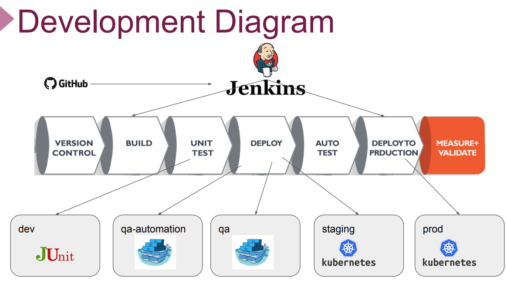

# Presentation Short Version

## Description
***
This project aims to create full CI/CD Pipeline for microservice based applications using [Spring Petclinic Microservices Application](https://github.com/spring-petclinic/spring-petclinic-microservices). Jenkins Server deployed on Elastic Compute Cloud (EC2) Instance is used as CI/CD Server to build pipelines.

## Problem Statement
***

## Abstract
***
Bu proje Spring firmasi tarafindan gelistirilmis Java tabanli bir petclinic microservis web uygulamasi. Uygulamanin frontend kismi React ile backend kismi ise java ile yazildi.

Uygulamanin **Home**, **owners** ve **veterenians** olmak uzere 3 ana menusu var.

Uygulamada 8 microservis bulunmakta ayrica prometheus ve grafananin oldugu bir monitoring servisi de bulunmaktadir. Bu servisler:
  1. Admin-server
  2. Api-gateway(UI  api-gateway)
  3. Custom­er-server
  4. Cofig-server
  5. Discovery-server
  6. Hystrix Dashboard
  7. Vet Server
  8. Visit Service

Fly veri tabani kullanilan cloud native bir uygulamadir.

### Development Diagram
***

## Expected Outcome
***
Farkli enviromenlar icin pipelinelar olusturarak uygulamanin build, unit test, deploy, auto test ve deploy to production asamalarini otomatize hale getirmek. 

Bunun icin 5 farkli pipeline kurdum:
    
**1. Pipeline-ci-job:** dev, feature ve bugfix branslari icin webhookla trigger edecek sekilde maven ile build edilecek ve jacoco, unit testlerini yapmak amaciyla pipeline kuruldu.
    
**2. Pipeline-nightly:** dev bransi icin functional testleri yapmak uzere docker-swarm uzerinde deploy edilmis environment da nightly-cronjob ile build, unit test, deploy ve functional testler yapilacak. Stable dir ancak tum testlerden gecmemis versioyondur.
    
**3. Pipeline-weekly:** Release bransindaki kodu her hafta pazar gunu build, unit test, deploy edildi. Manuel testerlar manuel testlerini bu enviroment da gerceklestirecek. 
    
**4. Pipeline-staging:** Release bransinda kod her hafta pazar gunu build, unit test, functional test, manuel testerlar manuel testleri yapacak v staging env a gidecek. Bundan sonrasi kod ile ne yapilacagi ile ilgili. Alfa, beta surecine gidilebilir, User acceptance testlerini yapmak icin musteriye sunulabilir. 
    
**5. Pipeline-prod:** Master brancinda webhook ile trigger ederek yapacagimiz her commitde kodumuza build, unit test, deploy ve functional test asamalarini uygulayarak musteriye sunulacak production ortamina deploy edecek. 

CI-job, nighty ve weekly pipeline lar docker swarm ile orchestrate edilmis iken staging ve prod pipeline lari ise kubernetes ile orchestrate edildi.

### Pipelines Configurations
***

## Projede Kullanilan Toollar
***
* **Programming Language:** Bash Script, Groovy
* **Infrastucture as Code:** Ansible, CloudFormation
* **Containerisation:** Docker
* **Container Orchestiration:** Kubernetes, Docker Swarm
* **CI/CD Pipeline:** Jenkins
* **Cloud:** AWS (EC2, VPC, EBS, IAM, ECR, AMI)
* **Monitorong:** Prometheus, Grafana
* **Version Control:** Git, GitHub
* **Build**: Maven
* **Others:** Docker-Compose, Helm, Rancher